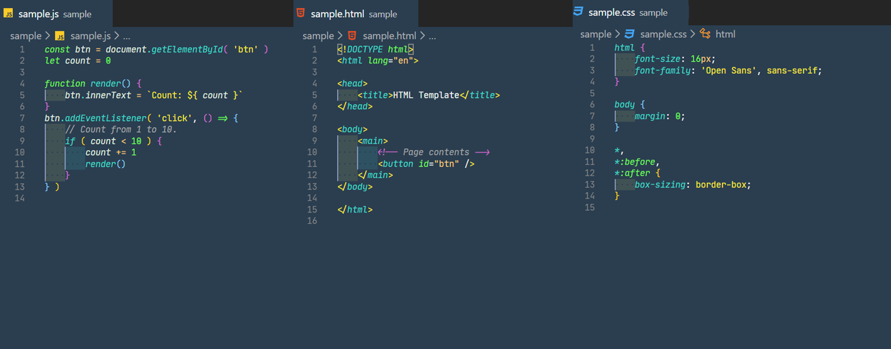

# **Zinogre color theme for Visual Studio Code** 

Zinogre color theme for [Visual Studio Code](https://code.visualstudio.com/).

## Feature & Image

This repo contains VS Code theme file that make your VS Code editor Zinogre color theme.

 

### Syntax highlighting in VS Code

Sample code is using [JetBrains mono](https://www.jetbrains.com/lp/mono/)

## Installation

### Install using Command Palette

1. Go to View -> Command Palette or press Ctrl+Shift+P
2. Then enter Install Extension
3. Type Zinogre
4. Select it or press Enter to install

### Activating theme

- The Zinogre Syntax theme will be available from `File` -> `Preferences` -> `Color Theme dropdown menu`.

## Author

takemal-studio

## About

- Credits:
  - Project inspired by [@zenorocha's](https://twitter.com/zenorocha) [dracula-theme](https://github.com/dracula/dracula-theme).

- Copyright
  - This repo uses material from the [Zinogre Photo Gallery](https://monsterhunter.fandom.com/wiki/Zinogre_Photo_Gallery) on the Monster Hunter Wiki at  [Fandom](https://www.fandom.com/) and is licensed under the Creative Commons Attribution-Share Alike License.

- License
  - MIT
