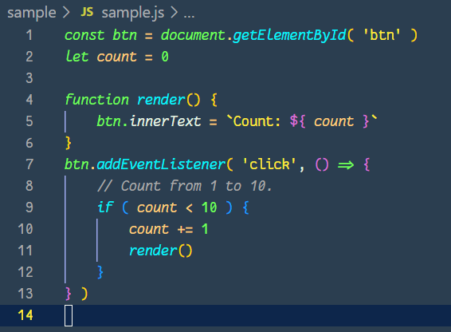
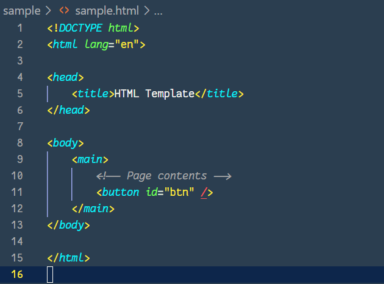

# **Zinogre color theme for Visual Studio Code** 


Zinogre color theme for [Visual Studio Code](https://code.visualstudio.com/).

## Feature & Image

This repo contains VS Code theme file that make your VS Code editor Zinogre color theme.

<div align="center">


</div>

<div align="center">

</div>

### Syntax highlighting in VS Code

<div align="center">

</div>

<div align="center">

</div>

<div align="center">

</div>

## Installation

### using Command Palette

1. Go to `View` -> `Command Palette` or press `Ctrl + Shift + P`
2. Then enter `Install Extension`
3. Type `Zinogre`
4. Select it or press Enter to install

### from [Visual Studio MarketPlace](https://marketplace.visualstudio.com/items?itemName=takemal-studio.zinogre)

## Activating theme

- The Zinogre color theme will be available from `File` -> `Preferences` -> `Color Theme` dropdown menu.

## Recommended Setting

### Font

The above sample codes' font is [JetBrains mono](https://www.jetbrains.com/lp/mono/).

If you want, you can download and add it into system font folder.

Then you can add this option in `setting.json` to have a custom font:

```json
{
    "editor.fontFamily": "JetBrains Mono Regular",
}
```

## Author

takemal-studio

## About

- Credits:
  - Project inspired by [@zenorocha's](https://twitter.com/zenorocha) [dracula-theme](https://github.com/dracula/dracula-theme).

- Copyright
  - This repo uses material from the [Zinogre Photo Gallery](https://monsterhunter.fandom.com/wiki/Zinogre_Photo_Gallery) on the Monster Hunter Wiki at  [Fandom](https://www.fandom.com/) and is licensed under the [Creative Commons Attribution-Share Alike License](https://creativecommons.org/licenses/by-sa/3.0/).

- License
  - MIT
